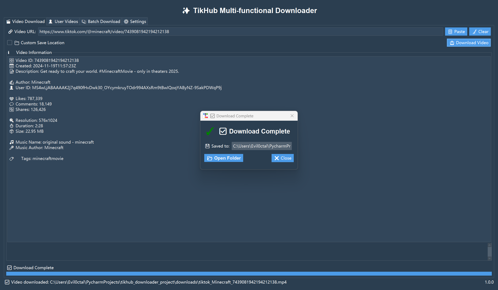
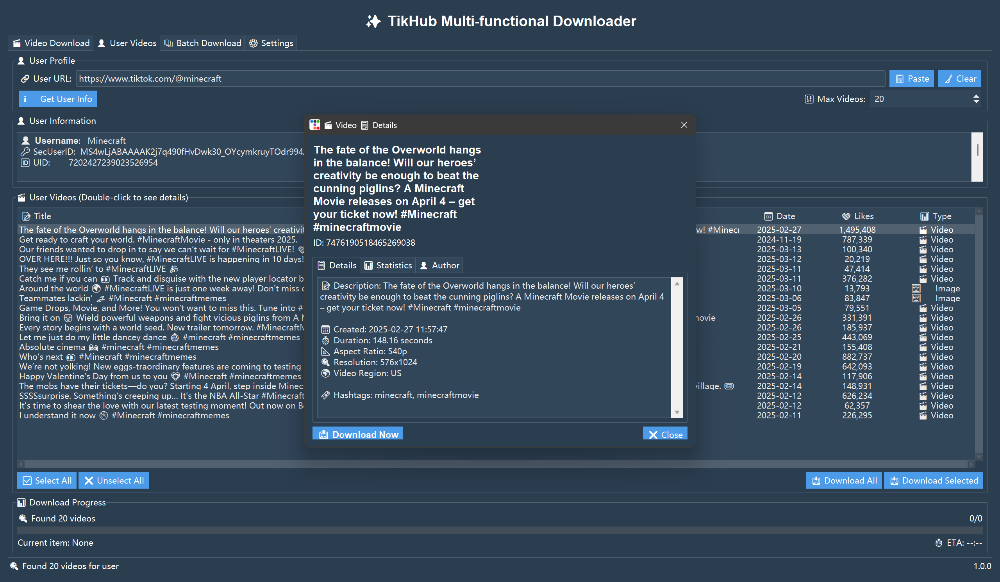
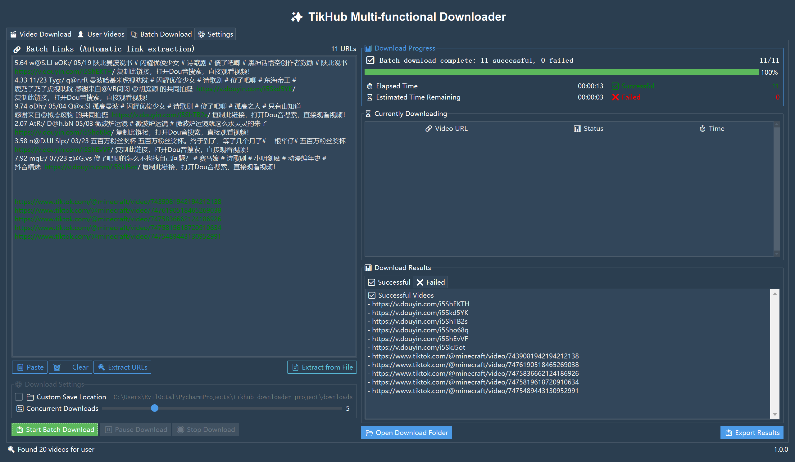
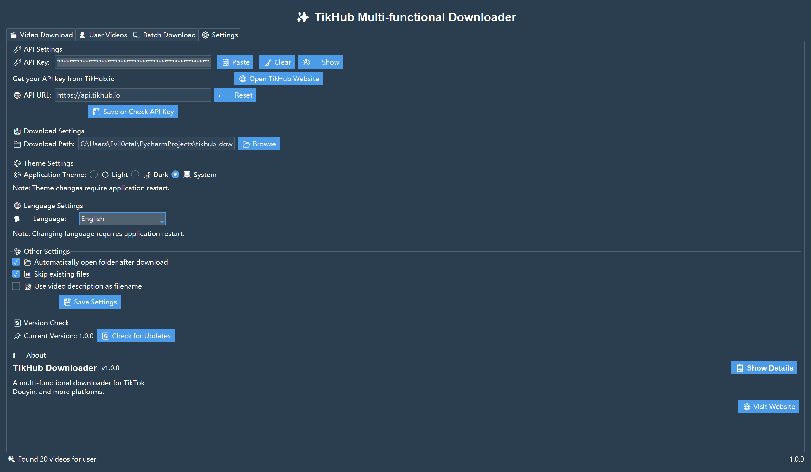

# TikHub-多功能下载器 🚀📱

<p align="center">
  <a href="README.md">English</a> | <b>简体中文</b>
</p>

[](https://github.com/TikHub/TikHub-Multi-Functional-Downloader/releases)
[](https://www.python.org/)
[](https://github.com/TikHub/TikHub-Multi-Functional-Downloader)
[](https://github.com/TikHub/TikHub-Multi-Functional-Downloader)
[](https://github.com/TikHub/TikHub-Multi-Functional-Downloader/issues)
[](https://github.com/TikHub/TikHub-Multi-Functional-Downloader/pulls)
[](https://github.com/TikHub/TikHub-Multi-Functional-Downloader/blob/main/LICENSE)
[](https://github.com/Evil0ctal)

一款强大的跨平台视频下载GUI应用，支持[TikTok](https://www.tiktok.com/)、[抖音](https://www.douyin.com/)等多个平台，基于[TikHub.io](https://tikhub.io/) API打造的无水印视频下载解决方案。

## 📋 目录

- [🌟 功能特点](#-功能特点)
- [🖥️ 系统需求](#️-系统需求)
- [🚀 安装与运行](#-安装与运行)
- [🔑 API密钥设置](#-api密钥设置)
- [📖 使用说明](#-使用说明)
- [📸 应用截图](#-应用截图)
- [❓ 常见问题](#-常见问题)
- [🤝 贡献指南](#-贡献指南)
- [📄 许可证](#-许可证)
- [🎉 致谢](#-致谢)

## 🌟 功能特点

- 📹 **多平台无缝支持**：
  - ✨ **TikTok 视频下载**：支持无水印下载各种TikTok视频、图集和音乐
  - ✨ **抖音视频下载**：完美支持抖音平台的视频、图集和音乐作品
  - 🔄 **自动识别平台**：智能检测链接类型，自动选择合适的下载方式
  
- 📥 **多样化下载选项**：
  - 🔗 **单视频下载**：通过分享链接快速无水印下载单个视频
  - 👤 **用户视频批量下载**：一键获取指定用户的所有公开视频
  - 📋 **批量链接处理**：支持多平台混合链接的批量下载
  - 🖼️ **图集下载支持**：完整保存多图作品，包括元数据
  
- 🛠️ **高级功能**：
  - 🧠 **智能解析**：自动处理短链接、重定向链接等各种链接形式
  - 🔍 **媒体预览**：下载前查看视频封面、用户信息和详细数据
  - 🎵 **音频提取**：可选择仅下载视频中的音频部分
  - 📊 **下载管理**：实时显示下载进度、速度和状态
  
- ⚙️ **用户友好设置**：
  - 🌓 **主题切换**：支持亮色、暗色和跟随系统模式
  - 🌍 **多语言支持**：内置中英文界面，支持社区语言拓展
  - 📁 **自定义存储路径**：灵活设置下载文件的保存位置
  - 🔄 **自动更新检查**：保持软件始终为最新版本

- 🔐 **安全与合规**：
  - 🛡️ **安全下载**：不包含任何广告或恶意代码
  - ⚖️ **合规使用**：设计用于下载用户有权访问的公开内容
  - 🔒 **隐私保护**：不收集个人数据，保护用户隐私

## 🖥️ 系统需求

### 💻 支持的平台
- 🪟 Windows 7/10/11 (最佳支持)
- 🍎 macOS 10.14+ (Intel & M1/M2)
- 🐧 Linux (Ubuntu, Debian, Fedora等)
- 🌐 其他支持 Python 3.9+ 的操作系统

### 🔧 技术要求
- 🐍 Python 3.9 或更高版本
- 📦 所需Python依赖（详见 `requirements.txt`）
- 🔑 TikHub.io API密钥（[免费获取](https://user.tikhub.io/)）
- 🌐 稳定的网络连接（中国大陆地区用户下载TikTok视频时建议使用代理工具）

## 🚀 安装与运行

### 📥 下载方式

#### 1. Windows 用户 (推荐) 💯
- ⬇️ 直接从 [Releases](https://github.com/TikHub/TikHub-Multi-Functional-Downloader/releases) 下载预编译的 `.exe` 可执行文件
- 📦 无需安装 Python 环境，开箱即用
- 🖱️ 双击运行应用程序

#### 2. 其他平台/源代码安装 🧩

##### 方法一：直接运行源代码 👨‍💻
1. 克隆仓库
```bash
git clone https://github.com/TikHub/TikHub-Multi-Functional-Downloader.git
cd TikHub-Multi-Functional-Downloader
```

2. 安装依赖
```bash
pip install -r requirements.txt
```

3. 运行应用
```bash
python main.py
```

##### 方法二：使用 build.py 打包 📦
1. 克隆仓库并进入目录
```bash
git clone https://github.com/TikHub/TikHub-Multi-Functional-Downloader.git
cd TikHub-Multi-Functional-Downloader
```

2. 安装打包依赖并执行打包
```bash
pip install -r requirements.txt
python build.py
```
- ✅ 将根据您的操作系统自动生成可执行文件
- 📁 生成的文件位于 `./dist` 目录中

## 🔑 API密钥设置

使用TikHub下载器需要从 [TikHub.io](https://user.tikhub.io/) 获取API密钥（完全免费）：

1. 🔐 在 [TikHub.io](https://user.tikhub.io/) 注册账号（仅需邮箱）
2. 📆 登录用户仪表板，点击页面顶部的 `签到` 按钮，获取每日签到奖励
    - **注意**：签到奖励会影响下载次数，每24小时可以领取一次
    - **注意**：如果您不签到，可能会导致无法下载视频
3. 📊 进入用户仪表板，点击左侧的 `API管理/价格` ，然后创建您的专属API密钥
4. ⚙️ 点击全选 `API Key Scopes` ，确保选择并给予所有权限给API密钥，然后点击保存
5. 💡 在应用程序的 `设置` 选项卡中输入API密钥，点击 `保存` 按钮
   - **注意**：API密钥仅在首次使用时需要设置，之后将自动保存在本地配置文件中
   - **注意**：如果您在使用过程中遇到任何问题，请检查API密钥是否正确
   - **注意**：如果您需要更高的下载次数，请考虑购买API套餐

## 📖 使用说明

### 🎬 单视频下载
1. 📋 从抖音/TikTok应用复制视频分享链接，示例如下：
    - 抖音：https://v.douyin.com/i5WdL2Ls/
    - TikTok：https://www.tiktok.com/@minecraft/video/7439081942194212138
2. 📲 在"视频下载"标签中粘贴视频URL
3. 🔍 点击"解析视频"获取视频信息
4. 👁️ 查看视频预览和详细信息
5. 💾 点击"下载视频"保存至本地

### 👤 用户视频下载
1. 🔗 复制用户主页URL，示例如下：
   - 抖音：https://www.douyin.com/user/MS4wLjABAAAAoctrW5qzQp6h2H32mRKenXU_0-cmgjgOxIc768mlwjqKVjQbFdD1NeEzi2TMbGM0
   - TikTok：https://www.tiktok.com/@minecraft
2. 📲 在"用户视频"标签中粘贴用户主页URL
3. 🔍 点击"获取用户信息"
   - 显示用户头像、昵称、粉丝数等信息
   - 这一步将触发一次API调用
4. 📊 设置要获取的视频数量（最大值取决于用户作品数量）
   - 默认获取用户最新的20个视频
   - 每增加20个视频，将触发一次API调用
5. ✅ 选择要下载的视频，或使用"下载全部视频"
6. 📥 等待下载队列完成

### 📚 批量下载
1. 📋 准备多个视频URL（每行一个）
2. 📲 在"批量下载"标签中粘贴这些URL
3. 🔍 点击"提取链接"验证可下载的链接数量
   - 支持混合平台的链接，并且支持短链接和重定向链接或分享文本
4. 📥 点击"开始批量下载"
   - 成功的链接将触发一次API调用
5. 📊 查看下载进度和状态
6. ✅ 所有下载完成后会显示成功/失败统计

### ⚙️ 高级设置
1. 📁 自定义下载文件夹路径，自动跳过已存在的文件（避免重复下载）
2. 🎛️ 调整并发下载数量
3. 🌓 选择界面主题（亮色/暗色/跟随系统）
4. 🌍 切换界面语言
5. 🔄 设置自动检查更新频率

## 📸 应用截图

### 1. 单一作品下载页面 🎬

- 🔗 支持抖音和TikTok链接作为输入
- 👁️ 可直接预览视频详细信息
- 📊 显示点赞数、评论数等数据
- 📥 一键下载功能

### 2. 用户主页下载页面 👤

- 🔍 支持抖音和TikTok用户主页链接
- ⚙️ 可设置最大视频数量
- 📊 显示用户资料和作品统计
- ✅ 批量选择下载

### 3. 批量下载页面 📚

- 🔄 支持混合平台的链接
- 🧠 一键提取输入文本中的链接
- 📁 支持从文本文件导入链接
- ⚡ 并行下载提升效率

### 4. 设置页面 ⚙️

- 🌓 支持主题切换（亮色、暗色、系统）
- 🌍 多语言支持（中文、英文）
- 🔌 社区贡献语言包接口
- 🔄 检查更新功能

### 5. 图集预览 - HTML预览 🖼️

- 🌐 自动生成HTML文件
- 📱 响应式设计，适合各种设备
- 🖼️ 支持图集和相册预览
- 👆 友好的图片浏览界面

### 6. 图集详情预览 📊

- 📝 查看图集详细信息
- 🌐 支持多平台图集预览
- ⏱️ 展示图集创建时间和相关元数据
- 💾 一键保存原始分辨率图片

## ❓ 常见问题

### 🔄 API使用相关问题

#### Q: 为什么我的API请求失败了？
A: 可能是以下原因：
- ⏰ 您今天的API调用次数已用完，每日签到可获取免费额度
- 🔑 API密钥未正确配置或已过期，请检查设置并确保已保存
- 🌐 网络问题导致无法连接到TikHub服务器

#### Q: 如何提高API调用次数限制？
A: 有几种方式：
1. 📆 每天登录[TikHub.io](https://user.tikhub.io/)进行签到，获取免费额度
2. 💰 购买更高等级的API套餐，获取更多调用次数和更高的并发限制
3. 📊 合理规划下载任务，避免不必要的API调用

### 📥 下载相关问题

#### Q: 为什么视频无法下载或解析失败？
A: 可能的原因：
- 🔒 该视频可能设置了私密权限，无法被公开访问
- 🌐 中国大陆用户下载TikTok视频时需要使用代理工具
- 🔗 链接格式不正确或已失效

#### Q: 如何下载高清视频？
A: 本软件默认下载最高清晰度版本。如果遇到问题：
- 🎥 原视频清晰度受限于原始上传质量
- 📱 某些平台可能限制高清视频下载

### ⚙️ 软件使用问题

#### Q: 软件启动失败怎么办？
A: 尝试以下方法：
1. 🔄 重新下载最新版本的软件
2. 📦 Windows用户尝试安装[Visual C++ Redistributable](https://learn.microsoft.com/zh-cn/cpp/windows/latest-supported-vc-redist)
3. 📝 检查日志文件（位于应用目录的 `app.log` 文件中）并联系开发者

#### Q: 如何备份我的设置和API密钥？
A: 配置文件位于：
    - `.\TikHub-Multi-Functional-Downloader\config.json`

备份此文件可保存您的所有设置和API密钥。

## 🤝 贡献指南

我们欢迎各种形式的贡献，无论是功能请求、bug报告还是代码贡献！

### 📝 如何贡献

1. 🍴 Fork 本仓库
2. 🌿 创建您的特性分支 (`git checkout -b feature/AmazingFeature`)
3. 💾 提交您的更改 (`git commit -m '添加了一些令人惊奇的功能'`)
4. 📤 推送到分支 (`git push origin feature/AmazingFeature`)
5. 🔄 提交 Pull Request

### 🌍 语言贡献
- 您可以通过添加新的语言文件来贡献翻译
- 语言文件位于 `./downloader/locales` 目录下
- 请使用ISO语言代码作为文件名（例如：`en.json`, `zh.json`）

### 🐛 报告问题
- 使用GitHub Issues报告问题
- 请提供详细的重现步骤和环境信息
- 附上相关的日志和截图会很有帮助

## 📄 许可证

本项目采用 GNU 通用公共许可证 (GNU GPL) 第 3 版。

### GNU 通用公共许可证 (GPL) 📜

版本 3，2007年6月29日

 版权所有 (C) 2007 自由软件基金会 <https://fsf.org/>

 允许每个人复制和发布本许可证文件的完整副本，但不允许对许可证文件进行修改。

#### 主要条款：

- 🆓 自由使用：任何人都可以出于任何目的使用本软件
- 🔄 自由分发：可以自由地复制和分发本软件
- 🛠️ 自由修改：可以修改源代码以满足您的需求
- 📖 源代码必须开放：任何分发本软件的修改版本必须同样以GPL许可证开源

完整许可证详情请查看 [LICENSE](https://github.com/TikHub/TikHub-Multi-Functional-Downloader/blob/main/LICENSE) 文件。

## 🎉 致谢

### 👨‍💻 开发者
- [@Evil0ctal](https://github.com/Evil0ctal) - 核心开发与维护

### 🌐 资源
- [TikHub.io](https://tikhub.io) - 提供强大的API支持
- [Python](https://python.org) - 主要开发语言
- [ttkbootstrap](https://github.com/israel-dryer/ttkbootstrap/) - GUI框架

### 📶 支持

- [🏠 Home](https://tikhub.io/) - TikHub主页
- [👨‍💻GitHub](https://github.com/TikHub) - TikHub GitHub主页
- [📧 Discord](https://discord.gg/aMEAS8Xsvz) - TikHub社区
- [⚡ Documents (Swagger UI)](https://api.tikhub.io/) - API文档
- [🦊 Documents (Apifox UI)](https://docs.tikhub.io/) - API文档

### 🙏 特别感谢
- 感谢所有通过问题报告、功能建议和代码贡献帮助改进项目的开发者和用户
- 感谢开源社区提供的各种工具和库
- 感谢所有为多语言支持做出贡献的翻译者

---

**📢 注意事项**：
1. ⚖️ 请遵守各平台的版权和使用政策，仅下载公开可用和您有权访问的内容
2. 📝 根据 GNU GPL v3 许可，任何基于本项目的修改或衍生作品必须同样遵循 GPL v3 并开放源代码
3. 🚫 本工具不应用于侵犯他人知识产权或违反服务条款的行为
4. 🔄 定期检查更新以获取最新功能和安全修复